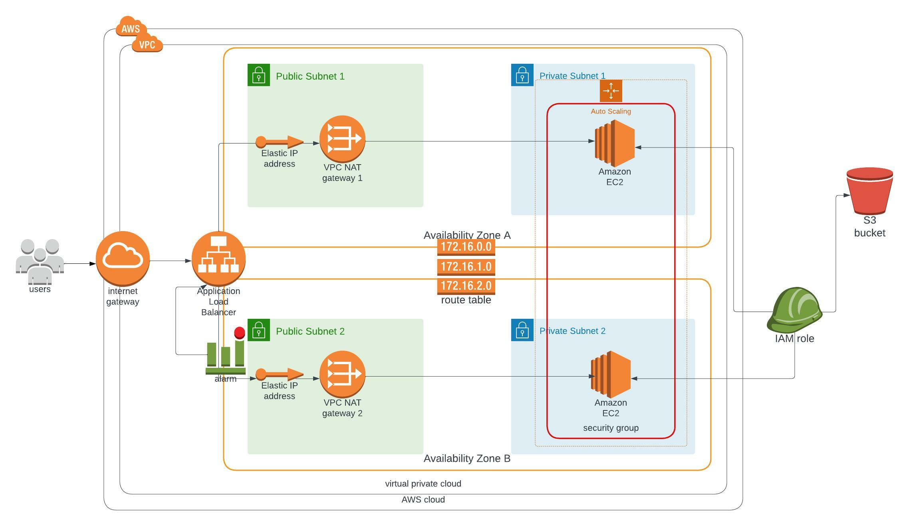

### Project 2 - Deploy a high-availability web app using CloudFormation
In this project, we are tasked to deploy webservers for a hihgly-available web app using AWS CloudFormation. We create and deploy the infrastructure and application for a dummy instagram-like application called Udagram. We begin the infrastructure deployment with the network template followed by the server side. We have also added AWS CloudWatchAlarms to notify as when we have errors.

### Infrastructure diagram
The diagram below shows the cloud diagram to be used as a guide for developing the infrastructure with cloud formation.
<br/>

### Project Requirements

1. Create a Launch Configuration for your application servers in order to deploy four servers, two located in each of your private subnets. The launch configuration will be used by an auto-scaling group.

2. You'll need two vCPUs and at least 4GB of RAM. The Operating System to be used is Ubuntu 18. So, choose an Instance size and Machine Image (AMI) that best fits this spec.

3. Be sure to allocate at least 10GB of disk space so that you don't run into issues.

### Folder Content
The folder contains the following files:


1.  `network-params.json` - contains cloudformation parameters for increasing the generic nature of the network yaml code. 
2. `server-params.json` - contains cloudformation parameters for increasing the generic nature of the server yaml files.  
3. `network-stack.yaml` - contains cloudformation code for creating and building network infrastructure for the highly-available (udagram).
4. `server-stack.yaml` - contains cloudformation code for building the EC2 infrastructure the app (udagram).
5. `images` - contains infrastructure diagram to aid in developing the cloudformation code.

## Main Components: 

- **VPC**  
  A VPC where all relevant infrastructure will be deployed into.

- **Public Subnets**  
  Public subnets contain ElasticIPs and NAT Gateways allowing access to the internet from within private
  subnets.

- **Private Subnets**  
  Private subnets contain EC2 instances which won't be accessible from outside.

- **Routing Tables and Routes**  
  Route Tables and Routes manage the traffic between the subnets and the internet through NAT Gateways and the Internet Gateway.

- **NAT Gateways and Internet Gateway**  
  NAT Gateways and Internet Gateways enable access between subnets and the internet.
  
- **Load Balancer, Autoscaling, Launch Configuration and Target Groups**  
  The Load Balancer allows to evenly distribute requests to EC2 instances located in private subnets. This is possible by specifying the relevant TargetGroup in the Load Balancer's Listener.

- **Security Groups**  
  Security Groups handle ingress and egress traffic for EC2 instances and in this project restrict ingress traffic to port 80.
  
- **IAM Role and Instance Profile**  
  An IAM role will be created allowing ReadOnly access to S3 where the project's deployment files are located.

### Bonus
- **CloudWatch Alarm and  SNS Topic**
Cloudwatch alarm for notifications and SNS Topic subscripton for sending email to the user.

### Create-Stack
To create the stack, use the code snippet as a guide:
```
./create-stack.sh <User-defined-stack-name> <name-of-yaml-file> <name-of-json_parameter-file>
```
- **You must create the network stack before the server stack**

### Update Stack
To make changes or update any of the stack, use:

```
./update-stack.sh <User-defined-stack-name> <name-of-yaml-file> <name-of-json_parameter-file>
```

### Delete Stacks
To delete the stack, use the same stack name you used when creating the stack as shown below:
```
./delete-stack.sh <User-defined-stack-name>
```

 
#### Output
The app url can be found at:  
 <a href="http://udagr-webap-1o8v9aaghnee4-394011335.us-east-1.elb.amazonaws.com/">http://udagr-webap-1o8v9aaghnee4-394011335.us-east-1.elb.amazonaws.com/</a>
